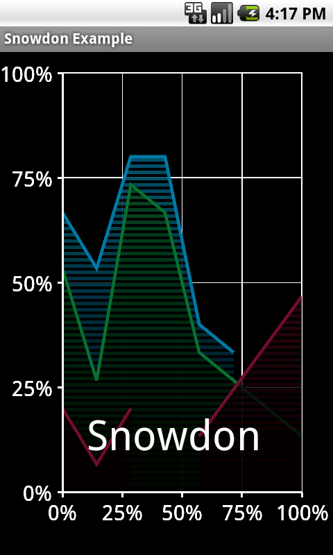

# Snowdon

A simple, fast, graphing library for Android.  
Forked from https://code.google.com/p/snowdon

The library provides the following view classes:

* AreaGraphView
* BarGraphView
* DataUtilities
* GraphView
* HeatMapLegendView
* HeatMapView
* HistogramGraphView
* LineGraphView
* ScatterGraphView

## Example application

The project contains a simple example application which uses the library.

## Screenshots

The [Images folder](Images) contains screenshots of the different view types.

## Members

* ajd.manton@googlemail.com

## License

* Code license: Apache License 2.0
